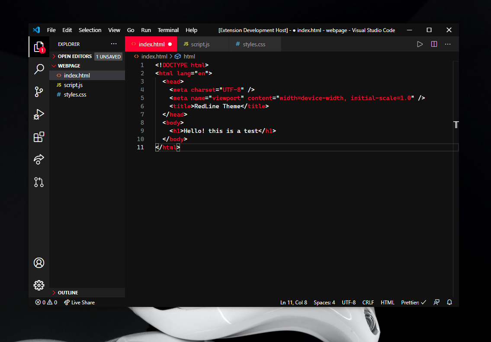

# RedLine Theme for [Visual Studio Code](https://marketplace.visualstudio.com/)

VS Code Theme inspired in the [RedLine icon pack](https://play.google.com/store/apps/details?id=com.jndapp.redline.linex.iconpack&hl=en&gl=US) for Android.

## Screenshot

## Instalation

This theme is available in the [Visual Studio Code Marketplace](https://marketplace.visualstudio.com/publishers/CamilaMartinezBedoya)

1. Install the extension
2. Go to **View -> Command Palette**
3. Write **Preferences: Color Theme** and press **Enter**
4. Find the theme **RedLine Theme**, press **Enter** and you are done!

## Author

Camila Martínez Bedoya

- [Instagram](https://www.instagram.com/cam.codes)
- [LinkedIn](https://www.linkedin.com/in/camila-martinez-5b43011a2/)

**Enjoy!**
